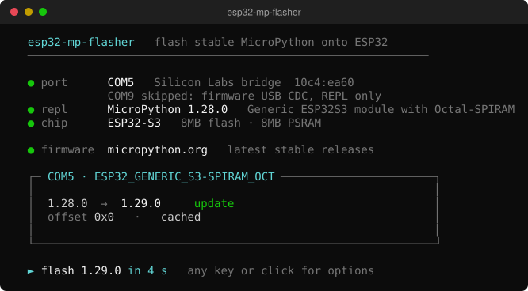

# micropython-esp-flasher

Install or update MicroPython on ESP32 boards from a Windows 10 or 11 (x64) computer.



## Features

The tool can:

- Find USB serial ports and update several ESP32 boards in one run.
- Select firmware from chip type, flash size, and PSRAM.
- Skip boards that need no update, including boards with a newer MicroPython version.
- Replace a recognised wrong build with the correct build of the same version.
- Ask for confirmation if it detects that a firmware change would lose files.
- Use downloaded firmware without an internet connection.

## Usage

1. Download the ZIP file from the [Rust build](https://github.com/rrokot/micropython-esp-flasher/actions/workflows/rust.yml).
2. Extract the ZIP file.
3. Connect your boards to the computer.
4. Double-click `micropython-esp-flasher.exe`.

The tool waits 5 seconds before it writes firmware or skips a board.
Press a key or click during this time to open the menu.
Select `flash`, `erase + flash`, `other build`, or `skip`.
`erase + flash` deletes all files on the board.

To report a problem, include the log file from the `logs` folder.

## Offline

The tool stores firmware in the `firmware` folder.
For offline use:

1. With the computer online, install each required firmware build on a board.
2. Copy the complete tool folder to the offline computer.

## Development

Build the program with Rust 1.99 or later:

```text
cargo build --release --locked
cargo test --locked
```

The program uses espflash as a library. It does not need a separate esptool program.
ESP8266 is not supported.

See [development notes](docs/development.md) for command-line options and board tests.
