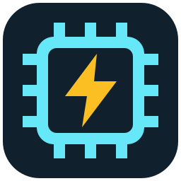

#  micropython-esp-flasher

Install and update MicroPython on ESP32 boards.

## Features

- Detect USB serial ports and update multiple boards.
- Select firmware by chip, flash size, and PSRAM.
- Skip current or newer firmware; correct known build mismatches.
- Check filesystem compatibility and require confirmation before data loss.
- Cache firmware for offline use and update the tool from GitHub Releases.

## Usage

[Releases](https://github.com/rrokot/micropython-esp-flasher/releases/latest): Windows x64, Linux x64/ARM64, macOS Intel/Apple Silicon.
Linux requires glibc ≥ 2.35, `libudev.so.1`, and serial port permissions.

The default action is automatic update. During the 5-second countdown, a key or click opens the action menu.
`Erase and install` deletes all files on the board.
